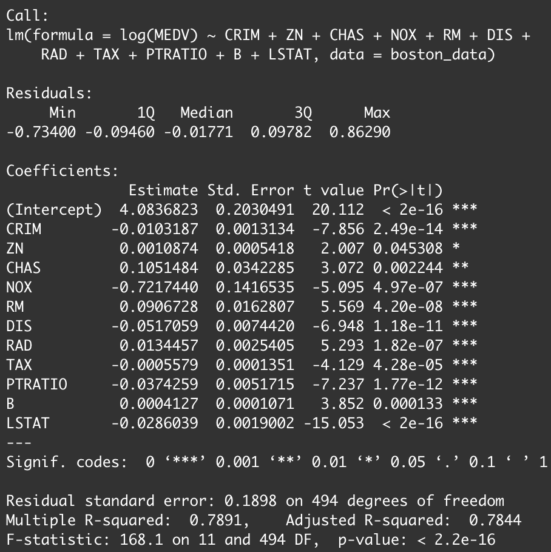

```{r, message=FALSE, echo=FALSE}
library(tidyverse)
library(knitr)
library(gt)
url = "https://raw.githubusercontent.com/DATA2002/data/master/boston.csv"
boston_data = readr::read_csv(url)
```

# Introduction 

## The Boston Housing Dataset 

The Boston housing data collected by the U.S Census Service consists of 506 rows each representing the census districts in Boston. The data is consist of 14 attributes and those are : 

- CRIM - per capita **crime rate** by town
- ZN - **proportion of residential land zoned** for lots over 25,000 sq.ft.
- INDUS - proportion of **non-retail business acres** per town.
- CHAS - Charles River dummy variable (1 if tract bounds river; 0 otherwise)
- NOX - **nitric oxides concentration** (parts per 10 million)
- RM - average **number of rooms** per dwelling
- AGE - proportion of owner-occupied units built prior to 1940
- DIS - weighted **distances** to five Boston employment **centres**
- RAD - index of **accessibility to radial highways**
- TAX - full-value **property-tax rate** per $10,000
- PTRATIO - **pupil-teacher ratio** by town
- B - 1000(Bk - 0.63)^2 where Bk is **the proportion of blacks** by town
- LSTAT - % lower status of the **population**
- MEDV - **Median value of owner-occupied homes in $1000's**

One of the prototasks of this data is to predict MEDV, the median value of a house price, which aligns with the aim of this report. 

## Collinearity between attributes

The dependent variable of this study is MEDV, the median value of a house price. All of the other 13 variables can be the independent variable of the multiple regression model. Correlation between individual independent variables and linearity of each were considered to make the stable and reasonable model.

Regarding the correlation, TAX and RAD , NOX and DIS were two pair of variables highly correlated as shown in the heatmap (Fig 1) of correlation. The correlation coefficient between TAX and RAD is 0.91 and the correlation coefficient between NOX and DIS is -0.77, indicating that one of the two variables should be eliminated from the multiple regression model to prevent collinearity. However, as this research wanted to test the effectiveness of all of the 13 attributes, all of the attributes were included in the model and the collinearity between some variables was acknowledged as a limitation.

# Analysis: Appropriate model selection

## Full model without any transformation

```{r echo=FALSE, fig.width=7,fig.height=3.5, dpi=300,out.width="240px",out.height="100px", warning=FALSE}

library(ggfortify)

M1 = lm(MEDV ~ ., data = boston_data)  # Full model
autoplot(M1, which = 1:2) + theme_bw(base_size = 12)

```

This research first created the multiple regression model with 13 variables for Boston House price and tested the assumption for multiple regression. The residuals versus fitted plot showed the non-linear pattern;  the residuals were located above the zero for the low and high house price while the residuals were below the zero in the middle house price. The research further conducted log transformation to satisfy the assumption and improve the performance.


## New full model with log transformation on MEDV

```{r echo=FALSE, fig.width=7,fig.height=3.5, dpi=300,out.width="240px",out.height="100px", warning=FALSE}

library(ggfortify)

M2 = lm(log(MEDV) ~ ., data = boston_data)  # Full model
autoplot(M2, which = 1:2) + theme_bw(base_size = 12)

```

The study was further developed by taking a log to the MEDV. This is because most of the individual pair-plot with each independent variable (except the categorical variable CHAS) against MEDV showed non-linearity.

The four assumption testing for multiple regression was taken with the full model.

- Linearity : The Residuals vs Fitted values plot does not have an obvious pattern. Therefore, the linearity assumption is met. 
- Homoskedasticity : The residuals appear to be fanning out on the region that fitted values are greater than 3.0, but generally, the spread looks reasonably constant over the fitted values. Therefore, the homoskedasticity assumption and the constant error variance assumption are met. 
- Independence : As each observation is independent of the other observations, the independence assumption is satisfied.
- Normality : In the QQ plot, there is an obvious pattern that does not stick to the diagonal line at each end of the plot. However, since this data has a large number of rows, i.e. this data has a large sample size (506), the Central Limit Theorem can be applied. 

As all 4 assumptions were satisfied by taking log transformation, the log-transformed MEDV was used for the rest of the study. 

## Create the model by AIC

Through the backward and forward search using AIC (Fig 2), the model with 11 variables was retrieved. This excluded INDUS and AGE variables. Further hypothesis testing was done to test whether there is any extra variable to add/drop from the AIC model and got the conclusion that model with 11 variables is suitable. As backward search using AIC and forward search using AIC suggested the same model with 11 variables, the model is stable. 

## Finding the best model 
This report chose RM, which has the highest correlation coefficient (Got from the visualized heatmap) with MEDV as a simple model. The adjusted R-squared of the model from AIC (that has 11 predictors) is 0.7841, the adjusted R-squared of the full model holding every 13 predictors is 0.7841, and the adjusted R-squared of the model that only holds RM as its predictor is 0.3983.

```{r, echo=FALSE,fig.width=7,fig.height=7, dpi=300,out.width="240px",out.height="100px", warning=FALSE}

knitr::include_graphics("456.png")

```

Cross-validation was done to observe RMSE and MAE for each model for preventing overfitting.
Since the created model has a slightly smaller RMSE and slightly smaller MAE than the full model, with a slightly larger adjusted R-squared, this study chose the step model.

## Assumption testing for multiple regression of selected predicates model

```{r echo=FALSE, fig.width=7,fig.height=3.5, dpi=300,out.width="240px",out.height="100px", warning=FALSE}

stepm = step(M2, trace = F)
autoplot(stepm, which = 1:2) + theme_bw(base_size = 10)

```

- Linearity : The Residuals vs Fitted values plot does not have an obvious pattern. Therefore, the linearity assumption is met. 
- Homoskedasticity : The residuals appear to be fanning out on the region that fitted values are greater than 3.0, but generally, the spread looks reasonably constant over the fitted values. Therefore, the homoskedasticity assumption and the constant error variance assumption are met.
- Independence : Each row in the data are independent. 
- Normality : In the QQ plot, there is an obvious pattern that does not stick to the diagonal line at each end of the plot. However, since this data has a large number of rows, i.e.this data has a large sample size (506), the Central Limit Theorem can be applied.

Therefore, all of the assumptions are met.


# Results

This is the formula of the final model.

$$\begin{aligned}
\operatorname{log(MEDV)}=&4.0837 - 0.0103 \times CRIM + 0.0011 \times ZN \\ &+ 0.0907 \times RM - 0.0517 \times DIS + 0.0134 \times RAD \\ &+ 0.1051 \times CHAS- 0.7217 \times NOX - 0.0006 \times TAX \\&- 0.0374 \times PTRATIO  +0.0004 \times B - 0.0286 \times LSTAT \\&+ \epsilon
\end{aligned} $$

**Log-linear model** $$log(Y) = \beta_0 + \beta_1x$$ 

On average, a one unit increase in $x$ will result in a $\beta_1$ * 100% change in $Y$. Based on the formula, there are **11 significant elements can effect the price of house**. 

- A one degree parts per million(ppm) increase in **NOX** results in **72.17% decrease** in MEDV on average, holding other variables are constant. 
- A 1 **CHAS** (if tract bounds Charles River) results in **10.51% increase** in MEDV on average, holding other variables are constant.
- A one number of room increase in RM results in 9.07% increase in MEDV on average, holding other variables are constant.
- A one unit weighted distances to five Boston employment centres increase in DIS results in 5.17% decrease in MEDV on average, holding other variables are constant.
- A one percent  increase in PTRATIO results in 3.75% decrease in MEDV on average, holding other variables are constant.
- A one percent increase in LSTAT results in 2.86% decrease in MEDV on average, holding other variables are constant.
- A one index increase in RAD results in 1.34% increase in MEDV on average, holding other variables are constant.
- A one unit of rate increase in CRIM results in 1.03% decrease in MEDV on average, holding other variables are constant.
- A one unit of proportion  increase in ZN results in 0.11% increase in MEDV on average, holding other variables are constant.
- A one increase in TAX results in 0.06% decrease in MEDV on average, holding other variables are constant.
- A one 1000(Bk - 0.63)^2 where Bk is the proportion of blacks by town increase in B results in 0.04% increase in MEDV on average, holding other variables are constant.

# Discussion and Conclusion

## Key conclusions

Having `NOX` and `CHAS` as the two variables that affect the house price the most, the study had reasonable inference that demand for clean air and the nature view was high at the moment this data was collected. This also aligns with the fact that the data was originally published in the article name “Hedonic prices and the demand for clean air”. Also, the increase in the room number (RM), decrease in distance to five Boston employment centers(DIS), decrease in the pupil-teacher ratio by town(PTRATIO) are also factors that increase the Boston house price. 

## Limitations

There were four acknowledged issues in this study that requires further research. The first issue is about highly correlated variables. TAX and RAD, NOX and DIS were the two pairs of variables with a high correlation coefficient greater than 0.7. As the models used in this study included all of the highly correlated variables, further research is needed to test the stability of the model. 

The second issue is about the homoscedasticity assumption for multiple regression. Even though the residuals vs fitted plot showed a fairly random distribution, as the plots with fitted values greater than 3.5 mildly fanned out, a further test is required for homoscedasticity assumption. 

```{r echo=FALSE, fig.width=7,fig.height=2, dpi=300,out.width="480px",out.height="100px", warning=FALSE}

M2 = lm(log(MEDV) ~ ., data = boston_data)  # Full model in log
autoplot(M2, which = 1) + theme_bw(base_size = 6)

```

Thirdly, as values in MEDV are bound to 50.00, that is \$50000, 16 cases that have 50.00 at their MEDV might have a higher median price than $50000. Therefore, further research with accurate house prices is needed to get the model that better represents the Boston house price.

The last potential issue is related to the small-sized data set. The data set has 506 cases which are large enough to make the model statistically reliable and representative. However, as the dataset sheet argued, it is not enough to represent the entire Boston house price. An increased number of data with a better representation of overall Boston house price is needed to make the model more representative. 

Although the Boston data used in this study is from 1978, which is outdated, this study still has some insights on the rising house prices that many people suffer. We hope that our analysis will help find a good balance between the wealth of the people and the factors that affect the house price.

# References

[GitHub repository](https://github.sydney.edu.au/bzho8030/M13-07)

[1]Alan Crawford. (2021, September 20). *The Global Housing Market Is Broken, and It’s Dividing Entire Countries*. Available at: https://www.bloomberg.com/news/features/2021-09-19/global-housing-markets-are-hurting-and-it-s-getting-political

[2]Harrison, D. & Rubinfeld, D.L. (1978). *The Boston Housing Dataset*. Available at: https://www.cs.toronto.edu/~delve/data/boston/bostonDetail.html

[3]Hao Zhu. (2021, February 19). *Create Awesome HTML Table with knitr::kable and kableExtra*. Available at: https://cran.r-project.org/web/packages/kableExtra/vignettes/awesome_table_in_html.html

[4]R-project.org. (n.d.). *R: The R Project for Statistical Computing*. Available at: https://www.r-project.org/

[5]Rmarkdown.rstudio.com. (n.d.). *R Markdown*. Available at: https://rmarkdown.rstudio.com/

[6]Tidyverse.org. (n.d.). *Tidyverse*. Available at: https://www.tidyverse.org/

[7]Tarr, G (2021). *DATA2002 Data Analytics: Learning from Data*. University of Sydney, Sydney Australia. Available at: https://pages.github.sydney.edu.au/DATA2002/2021/

```{r, echo=FALSE}

# code for Fig 1

#cor_mat = cor(boston_data)
#melted_cor_mat = cor_mat %>%
#  data.frame() %>% 
#  rownames_to_column(var = "var1") %>% 
#  gather(key = "var2", value = "cor", -var1)
#ggplot(data = melted_cor_mat, 
#       aes(x=var1, y=var2, fill=cor)) + 
#geom_tile() + theme_minimal() +
#scale_fill_gradient2(
#    low = "blue", high = "red", mid = "white", 
#    midpoint = 0, limit = c(-1,1)) +
#theme(axis.text.x = element_text(angle = 90, hjust = 1))

```


```{r, fig.cap="heatmap", echo=FALSE,fig.width=7,fig.height=7, dpi=300,out.width="240px",out.height="240px", warning=FALSE}

knitr::include_graphics("789.png")

```

```{r, echo=FALSE}

# code for Fig 2

#step.aic = step(M2, trace = FALSE)
#summary(step.aic)

```

```{r, fig.cap="AIC searching", echo=FALSE,fig.width=7,fig.height=7, dpi=300,out.width="240px",out.height="240px", warning=FALSE}



```