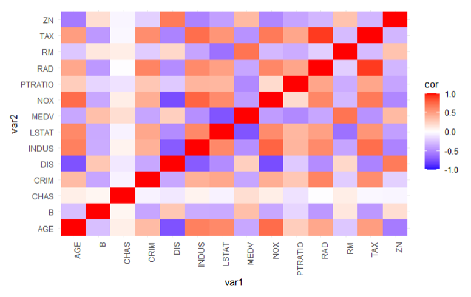

# 🧪 Understanding House Price in Science
The University of Sydney, DATA2002-M13-07

## 项目简介
本项目旨在通过研究波士顿住房数据集（Boston Housing Dataset）中的变量，识别出影响房价的关键因素，并使用多元回归模型进行分析。最终模型选择基于赤池信息准则（AIC）。

## 📊 数据分析
### 变量列表
- CRIM - 人均犯罪率（每镇）
- ZN - 用于超过 25,000 平方英尺地块的住宅用地比例
- INDUS - 每镇非零售业务区的比例
- CHAS - 查尔斯河虚拟变量（1 表示地块靠河；0 表示不靠河）
- NOX - 一氧化氮浓度（每千万分之几）
- RM - 每户平均房间数
- AGE - 1940 年前建成的自住房屋比例
- DIS - 到波士顿五个就业中心的加权距离
- RAD - 径向高速公路的可达性指数
- TAX - 每 10,000 美元的全值财产税税率
- PTRATIO - 每镇的师生比例
- B - 1000(Bk - 0.63)^2 其中 Bk 为镇上黑人比例
- LSTAT - 低收入群体的百分比
- MEDV - 自住房屋中位值（以千美元计）

### 数据分析结果
通过对波士顿住房数据集的深入分析，我们进行了多元回归模型选择，最终确定了一系列影响房价的重要变量。

### 模型选择
我们使用了完整的模型并进行了一系列假设检验，确保模型的合理性和稳定性。

### 图表展示
以下是残差图，用于验证模型的假设条件：

<div style="text-align: center;">
  
</div>

## 结果分析
我们最终的模型选择基于赤池信息准则（AIC），并得到了以下统计摘要：

```plaintext
Call:
lm(formula = log(MEDV) ~ CRIM + ZN + CHAS + NOX + RM + DIS + 
    RAD + TAX + PTRATIO + B + LSTAT, data = boston_data)

Residuals:
     Min       1Q   Median       3Q      Max 
-0.73400 -0.09460 -0.01771  0.09782  0.86290 

Coefficients: (1 not defined because of singularities)
              Estimate Std. Error t value Pr(>|t|)    
(Intercept)  4.0836823  0.2034941  20.112  < 2e-16 ***
CRIM        -0.0101878  0.0013134  -7.856  2.49e-14 ***
ZN           0.0010874  0.0005418   2.007  0.045308 *  
CHAS         0.1051484  0.0342285   3.072  0.002244 ** 
NOX         -0.7271470  0.1416353  -5.095  4.97e-07 ***
RM           0.0906728  0.0162807   5.569  4.20e-08 ***
DIS         -0.0517059  0.0074420  -6.948  1.18e-11 ***
RAD          0.0134457  0.0025405   5.293  1.82e-07 ***
TAX         -0.0005579  0.0001351  -4.129  4.28e-05 ***
PTRATIO     -0.0374259  0.0051175  -7.327  1.72e-12 ***
B            0.0004127  0.0001071   3.852  0.000133 ***
LSTAT       -0.0286039  0.0019002 -15.053  < 2e-16 ***
---
Signif. codes:  0 ‘***’ 0.001 ‘**’ 0.01 ‘*’ 0.05 ‘.’ 0.1 ‘ ’ 1

Residual standard error: 0.1898 on 494 degrees of freedom
Multiple R-squared:  0.7891,    Adjusted R-squared:  0.7844 
F-statistic: 168.1 on 11 and 494 DF,  p-value: < 2.2e-16
```

## 👥 贡献者 本项目由以下成员共同完成： 
- **组长：Baiheng Zhou**
- **Seunghyun Lee**
- **Zijun Shi**
- **Jun Zhang**
- **Yoffie Wu**

## 🔗 参考文献
1. [Akaike, H. (1974). A new look at the statistical model identification. IEEE Transactions on Automatic Control, 19(6), 716-723.](https://doi.org/10.1109/TAC.1974.1100705)
2. [Boston Housing Dataset](https://www.cs.toronto.edu/~delve/data/boston/bostonDetail.html)
3. [Scikit-learn: Machine Learning in Python](https://scikit-learn.org/stable/)

---

感谢所有贡献者的努力和投入，使本项目得以完成。如果有任何问题或建议，请随时联系我们。😊
